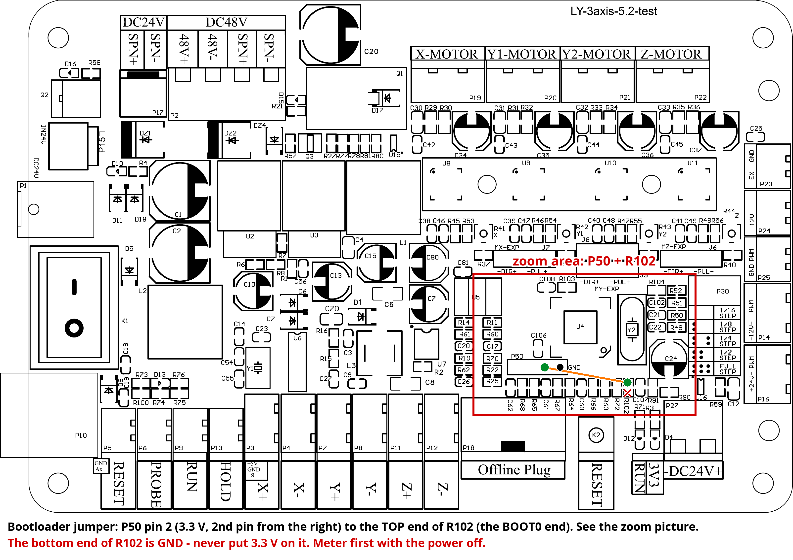
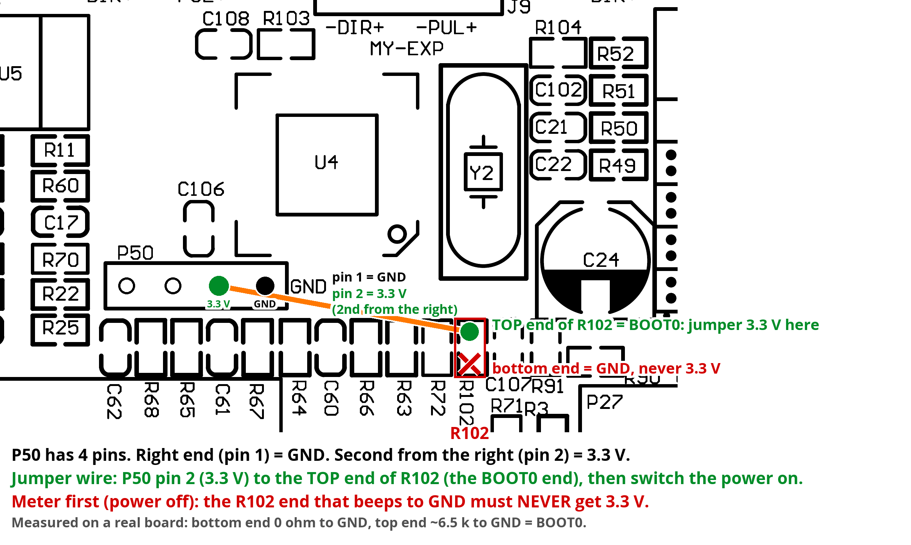

# grblHAL for the Lunyee 3020 (LY-3axis-5.2-V3.4 control board)

grblHAL firmware for the control board of the Lunyee 3020 CNC router (board silkscreen
LY-3axis-5.2-V3.4, an AnnoyTools 5.2 design: GD32F303CCT6 chip, CH340 USB), plus Lunyee's
factory firmware for going back. Flashing needs only the normal USB cable and, the first time,
one jumper wire. Every later update is USB only thanks to a `$BOOT` command.
The chip cannot be bricked: its bootloader is in ROM, and the wire always gets you back in.

Not affiliated with Lunyee. Use at your own risk.

## Files

| File | What | Download |
| --- | --- | --- |
| grblHAL firmware | `grblhal-lunyee3020-stock-2026-10-04.bin`: grblHAL 1.1f for this board, built from the [source](https://github.com/mojavemesa-lgtm/grblHAL-STM32F1xx-lunyee) (commit 7a63f5a, PlatformIO env `lunyee_3axis`). | https://github.com/mojavemesa-lgtm/lunyee-3020-grblhal/releases/download/2026-10-04/grblhal-lunyee3020-stock-2026-10-04.bin |
| Stock Lunyee firmware | `_VGRBL-3axis-1.0.8.4.hex`: Lunyee's factory firmware 1.0.8.4 (GRBL 1.1f, build 2025-09-29), as shipped on the 3020. It cannot be read out of the chip, so keep a copy. | https://github.com/mojavemesa-lgtm/lunyee-3020-grblhal/releases/download/2026-10-04/_VGRBL-3axis-1.0.8.4.hex |
| grblHAL source | The grblHAL STM32F1xx driver with this board added. | https://github.com/mojavemesa-lgtm/grblHAL-STM32F1xx-lunyee |

Both firmware files are also in the `firmware/` and `factory/` folders of this repository; `SHA256SUMS` has their checksums.

## What is in the grblHAL build

- Lunyee's stock machine settings as defaults: 800 steps/mm, 2000/2000/100 mm/min, acceleration 20, homing to front-left with Z up, soft and hard limits off, 10 kHz spindle PWM.
- The board's input polarity baked in (`$5=7 $6=1 $14=7 $17=1`), so `$RST=$` gives a working board.
- `$BOOT`: restarts the chip in its ROM serial bootloader, so the next flash needs no wire.
- The reset button and the CH340 DTR line act as a soft reset, same as stock.
- Serial at 115200 8N1 on the USB-B port (shared with the offline-controller plug). 3 axes, spindle PWM on the laser port's PWM pin, no coolant outputs.

## You need

- `firmware/grblhal-lunyee3020-stock-2026-10-04.bin`
- `factory/_VGRBL-3axis-1.0.8.4.hex` (for going back)
- `stm32flash` (Linux package, or the Windows build from SourceForge)
- one jumper wire with a female socket on one end

Unplug anything else on the board's serial port (offline controller, Wi-Fi bridge, pendant).

## 1. The wire

Power off, open the box. P50 is the 4-pin header below-left of the big chip U4. R102 is in the row of small parts directly under P50.





Plug the wire onto P50 pin 2 (second from the GND end). Hold the other end on the TOP end of R102. Not the bottom end: that is ground. Power on with the wire held. The board looks dead; that is correct, it is waiting in the bootloader.

## 2. Flash

The board is `/dev/ttyUSB0` on Linux or a COM port on Windows (write `COM5` instead). Use 57600 baud; 115200 fails its verify on this board.

1. Identify (expect chip ID 0x414):

   ```
   stm32flash -b 57600 /dev/ttyUSB0
   ```

2. First time only: unlock, then power off and on with the wire still held:

   ```
   stm32flash -b 57600 -k /dev/ttyUSB0
   ```

3. Write. It must end with the verify at 100 %. If it fails, run it again; do not power off.

   ```
   stm32flash -b 57600 -w grblhal-lunyee3020-stock-2026-10-04.bin -v -S 0x08000000 /dev/ttyUSB0
   ```

4. Remove the wire, power off and on. Connect at 115200 8N1: the banner reads `GrblHAL 1.1f`. Send `$RST=$` once, then `$H`.

## 3. Updates: $BOOT

1. Send `$BOOT` at 115200. The board goes quiet. Close the sender.
2. Write as in step 2 (identify, write). No unlock, no wire.
3. Start it without a power cycle:

   ```
   stm32flash -b 57600 -g 0x08000000 /dev/ttyUSB0
   ```

Never start after a failed write; repeat the write first. Settings are kept, position is lost: home before the next job.

## Back to factory

Enter the bootloader (`$BOOT`, or the wire), then:

```
stm32flash -b 57600 -w _VGRBL-3axis-1.0.8.4.hex -v /dev/ttyUSB0
```

Power-cycle. Re-send your stock settings (`$33`-`$37` come back on). The factory firmware has no `$BOOT`, so the next move to grblHAL needs the wire again.

## If it goes wrong

| You see | Do |
| --- | --- |
| `Failed to init device` | The chip is running GRBL, not the bootloader. Power off, wire on, power on, retry. |
| Write stops part way | Run the write again. Do not power off, do not send `-g`. |
| Silent after flashing | Remove the wire and power-cycle. Still silent: wire on, identify, write again. |
| Banner twice on connect | Normal, same as stock. |
| `Pn:XYZ` or `Pn:P` with nothing pressed | `$5=7 $6=1 $14=7 $17=1` then `$X`. |

## The long version

The short guide above is enough to do the job. This part explains what each step does, for people who want to understand it, and ends with a ready-made prompt you can paste into an AI assistant that will then walk you through it.

### What you are actually doing

The brain of the control board is a GD32F303 microcontroller, a Chinese twin of the STM32F103. Every chip in that family has a tiny program burned in at the factory, the ROM bootloader, that can receive a new program over a serial line. It is permanent and cannot be erased, so you can always get back to it. The USB socket on the control box is a CH340 USB-to-serial chip wired to the same serial pins the bootloader listens on. That is why a plain USB cable is enough and no programmer is needed.

At power-on the chip looks at one pin, BOOT0. If it is low, the chip runs the firmware in its flash memory (GRBL). If it is high, the chip runs the bootloader instead. On this board BOOT0 is held low by R102, a 10 k resistor to ground, and there is no button or jumper for it. The wire from P50 pin 2 (the board's 3.3 V supply) to the top end of R102 pulls BOOT0 high. Only a third of a milliamp flows through the resistor, so nothing can be damaged. The bottom end of R102 is ground, which is why the wire must never touch it. Once the chip is in the bootloader nothing else runs, so the board looks dead.

### Step 2 in detail

- **Baud rate and parity.** The bootloader talks at 8 data bits, even parity, 1 stop bit. stm32flash uses that by default, so you only give the speed. The CH340 chip on this board makes errors at 115200 with parity on, and the write then fails its check. 57600 is reliable and takes about a minute and a half for the 170 KB file.
- **Identify.** stm32flash sends a sync byte and the bootloader answers with its chip ID. 0x414 means "STM32F10x high density, 256 KB flash"; the GD32 reports itself as its STM32 twin. If the command says it cannot init the device, the chip is not in the bootloader, which nearly always means the wire was not making contact at the moment the power came on.
- **Unlock.** Lunyee ships the chip with read protection on, so the factory firmware cannot be copied out of it. Read protection also blocks writing. The `-k` option removes it. On a genuine STM32 this erases the whole chip; on this GD32 it did not, but treat it as if it does. After `-k` the bootloader drops the connection, so you power off and on with the wire still held, then identify again. This is only ever needed once.
- **Write.** `-w` names the file, `-v` reads every block back and compares it, and `-S 0x08000000` is the address where flash starts. A `.bin` file has no addresses of its own, so the start address must be given. A `.hex` file carries its own addresses, which is why the factory file is written without `-S`. The progress counter runs to 100 % twice: once writing, once verifying.
- **First boot.** With the wire removed and the power cycled, BOOT0 is low again and the chip starts grblHAL. The settings live in the last page of flash, separate from the program. `$RST=$` writes the built-in defaults into that page so you start from a known state. `$H` homes the machine.

### How `$BOOT` works

Standard grblHAL has no way to reach the bootloader. This build adds the `$BOOT` command: it writes a marker word into RAM and resets the chip. The very first thing the firmware does on start is check for that marker; if it is there, it clears it and jumps into the ROM bootloader exactly as if BOOT0 had been high. From then on stm32flash works as in step 2, no wire and no open box. The `-g 0x08000000` command tells the bootloader to start the program at the beginning of flash, so the board comes back without a power cycle.

The write only erases the pages the new program needs, so the settings page is left alone and your settings survive an update. Position is lost because the chip resets. If a write fails half way and you send `-g`, the chip tries to run a half-written program and hangs. Then, and only then, you need the wire again. Repeating the write instead of sending `-g` avoids that.

### What changes compared with Lunyee's stock GRBL

- The G-code and the senders are the same: UGS, Candle, gSender, OpenBuilds CONTROL and LightBurn all work. The banner says `GrblHAL 1.1f` instead of `Grbl 1.1f`.
- The classic settings keep their numbers (`$100` steps per mm and so on). `$$` lists many more settings than before; the extra ones can be ignored.
- Lunyee's own extras `$33` to `$39` (buzzer, laser checks, motor hold) do not exist. To hold the motors energized at idle, set `$1=255`, the standard GRBL way. The default `$1=25` releases them 25 ms after a move, like the stock machine.
- Soft limits are off by default, like stock. To use them, set `$130`, `$131`, `$132` to your real travel and `$20=1`.
- The handheld offline controller that plugs into the board has not been tested with grblHAL.

### Windows notes

The board shows up in Device Manager under Ports as "USB-SERIAL CH340 (COMx)". Download the Windows build of stm32flash from its SourceForge page, unzip it, open a Command Prompt in that folder, and use the same commands with `COM5` (or whatever number you saw) in place of `/dev/ttyUSB0`, for example `stm32flash -b 57600 COM5`.

### Let an AI assistant walk you through it

Copy everything in the box below and paste it into your AI assistant (ChatGPT, Claude, Gemini or similar). It contains every fact the assistant needs, so it will not have to guess, and it will go one step at a time.

```
I want to flash grblHAL onto the control board of my Lunyee 3020 CNC router, following the guide at https://github.com/mojavemesa-lgtm/lunyee-3020-grblhal. Walk me through it ONE step at a time, wait for my answer after each step, and use plain language. First ask me which operating system my computer runs and whether I already have stm32flash installed. Trust the facts below over your general knowledge.

FACTS
- Board: Lunyee LY-3axis-5.2-V3.4 (an AnnoyTools 5.2 design). Chip: GD32F303CCT6, compatible with the STM32F103RC, 256 KB flash, identifies as chip ID 0x414. The board's USB socket is a CH340 USB-serial chip connected to the chip's bootloader serial pins, so the normal USB cable is used for flashing. The board has no boot button and no boot jumper.
- grblHAL firmware file: grblhal-lunyee3020-stock-2026-10-04.bin from https://github.com/mojavemesa-lgtm/lunyee-3020-grblhal/releases/download/2026-10-04/grblhal-lunyee3020-stock-2026-10-04.bin
- Stock Lunyee firmware for going back: _VGRBL-3axis-1.0.8.4.hex from https://github.com/mojavemesa-lgtm/lunyee-3020-grblhal/releases/download/2026-10-04/_VGRBL-3axis-1.0.8.4.hex
- Tool: stm32flash (Linux: the package named stm32flash; Windows: the build from the stm32flash SourceForge page, run from a Command Prompt in its folder). Serial port: /dev/ttyUSB0 on Linux, COMx on Windows (Device Manager > Ports > USB-SERIAL CH340).
- Before starting: unplug anything else connected to the board's serial port (offline controller, Wi-Fi bridge). Only the PC may be on the USB cable.

FIRST FLASH ONLY: THE WIRE
- With the machine powered OFF, open the control box. Find the big square chip U4. Just below-left of it is a 4-pin header labelled P50. Directly under P50 is a row of small parts; R102 is one of them, close to the GND end of P50.
- Plug the socket end of a jumper wire onto pin 2 of P50 (the second pin counting from the GND end). Hold the other end on the TOP end of R102. Never the bottom end of R102, that is ground.
- Switch the power on while holding the wire. The board looks dead. That is correct: the chip is waiting in its ROM bootloader.

COMMANDS (replace /dev/ttyUSB0 with the COM port on Windows; always 57600 baud, 115200 fails verification on this board)
1. Identify: stm32flash -b 57600 /dev/ttyUSB0        -> expect chip ID 0x414
2. First time only, remove read protection: stm32flash -b 57600 -k /dev/ttyUSB0        -> then power off and on with the wire still held, and run step 1 again
3. Write and verify: stm32flash -b 57600 -w grblhal-lunyee3020-stock-2026-10-04.bin -v -S 0x08000000 /dev/ttyUSB0        -> must end at 100 % verified; if it fails, run the same command again, do not power off
4. Remove the wire. Power off and on. Connect a GRBL sender at 115200 baud, 8N1. The banner says GrblHAL 1.1f. Send $RST=$ and then $H.

LATER UPDATES (no wire, no open box)
- Send $BOOT to the running grblHAL from the sender's console. The board goes quiet. Close the sender so the port is free.
- Run the identify and write commands from steps 1 and 3 (no unlock needed).
- Start it without a power cycle: stm32flash -b 57600 -g 0x08000000 /dev/ttyUSB0
- Never send -g after a failed write; repeat the write first. Settings survive an update; machine position does not, so home with $H before the next job.

BACK TO THE STOCK FIRMWARE
- Enter the bootloader ($BOOT, or the wire), then: stm32flash -b 57600 -w _VGRBL-3axis-1.0.8.4.hex -v /dev/ttyUSB0   (no -S for a .hex file). Power off and on. The stock firmware has no $BOOT, so the next change needs the wire again.

IF SOMETHING GOES WRONG
- "Failed to init device" = the chip is not in the bootloader. Power off, wire on, power on, try again.
- Write stops part way = run the write command again. Do not power off, do not send -g.
- Board silent after flashing = remove the wire and power-cycle. Still silent: wire on, identify, write again.
- Banner printed twice on connect = normal, same as stock.
- The status line shows Pn:XYZ or Pn:P with nothing pressed = send $5=7 $6=1 $14=7 $17=1 and then $X.
- The chip cannot be bricked: the bootloader is in ROM and the wire always gets you back in.
```

## Source and licence

grblHAL is GPLv3 (see `LICENSE`). The complete source for the binary is in the
[grblHAL-STM32F1xx-lunyee repository](https://github.com/mojavemesa-lgtm/grblHAL-STM32F1xx-lunyee):
board map `boards/lunyee_3axis_map.h`, build env `lunyee_3axis` in `platformio.ini`,
`$BOOT` in `Src/driver.c` and `Src/system_stm32f1xx.c`. Build with PlatformIO:
`pio run -e lunyee_3axis`.

Lunyee's factory firmware is a GRBL 1.1f derivative (also GPL); ask Lunyee support for its source.
